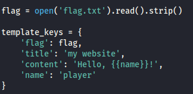
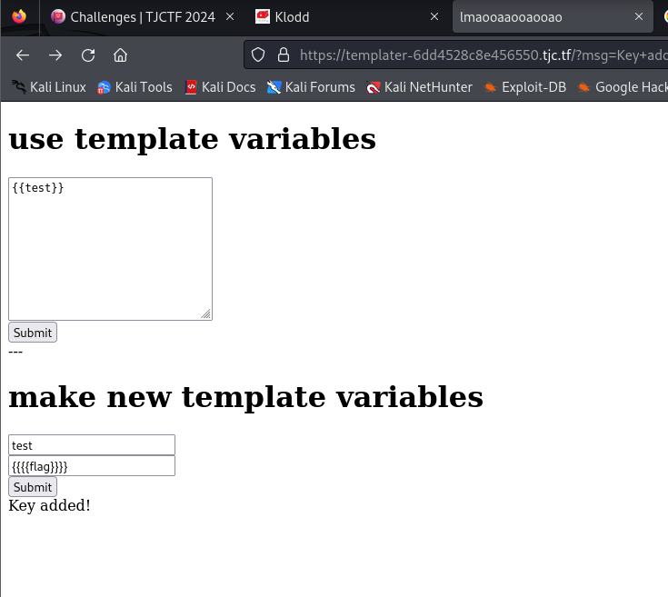

# TJCTF 2024 - web/templater   
 --- 
   
如果輸入 `{{title}}` 當作template variable，就會得到title這個key相對應的value(my website)作為return值   
    
    
從code中找到flag存在哪裡，但是根據後面的code可以發現，直接輸入{{flag}}當作template variable會得到 `No flag for you!` 的return值   
    
自己新增一個key:value pair `test:{{{{flag}}}}`    
(不能用 test:{{flag}} 的原因，是因為當他return {{flag}} 時他會解析一次，如此一來又會被filter抓到flag被暴露出去，所以會失敗)   
(然而雖然code可以重複解析key value pair，但是並不會重複進入filter檢查 → 見 code `template\_route()` 和 `template(s)` 這兩個function)   
    
    
   
> code   

```
from flask import Flask, request, redirect

import re


app = Flask(__name__)


flag = open('flag.txt').read().strip()


template_keys = {

    'flag': flag,

    'title': 'my website',

    'content': 'Hello, {{name}}!',

    'name': 'player'

}


index_page = open('index.html').read()


@app.route('/')

def index_route():

    return index_page


@app.route('/add', methods=['POST'])

def add_template_key():

    key = request.form['key']

    value = request.form['value']

    template_keys[key] = value

    return redirect('/?msg=Key+added!')


@app.route('/template', methods=['POST'])

def template_route():

    s = request.form['template']

    

    s = template(s)


    if flag in s[0]:

        return 'No flag for you!', 403

    else:

        return s


def template(s):

    while True:

        m = re.match(r'.*({{.+?}}).*', s, re.DOTALL)

        if not m:

            break


        key = m.group(1)[2:-2]


        if key not in template_keys:

            return f'Key {key} not found!', 500


        s = s.replace(m.group(1), str(template_keys[key]))


    return s, 200


if __name__ == '__main__':

    app.run(port=5000)


```