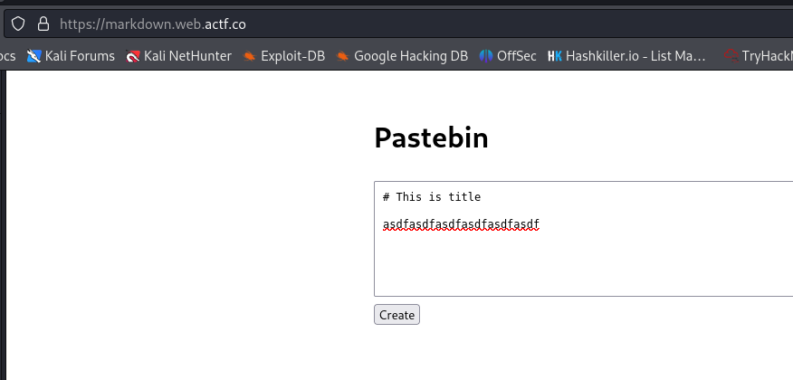
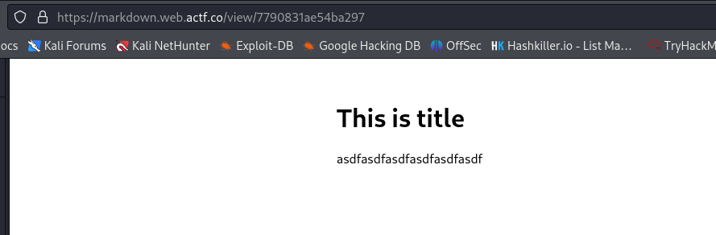
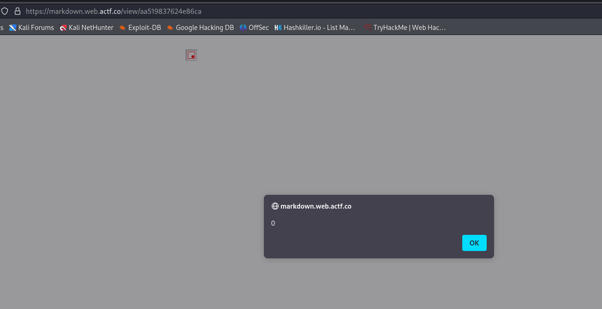
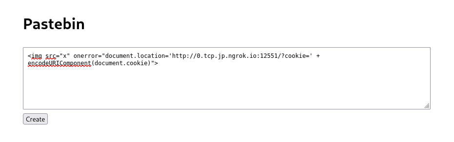
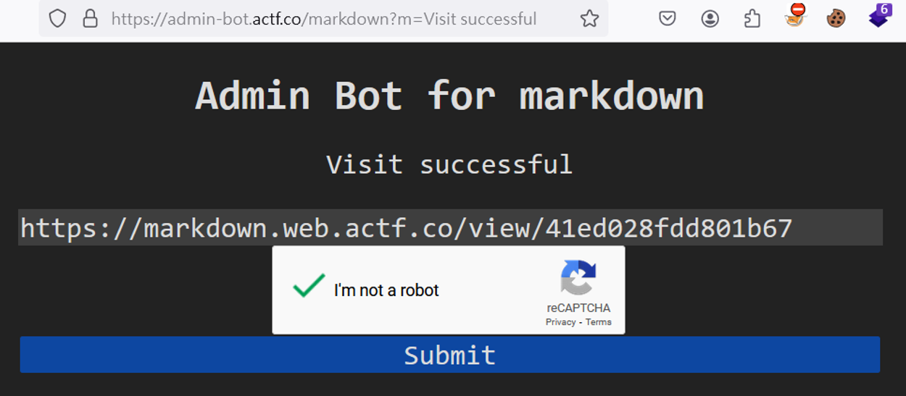
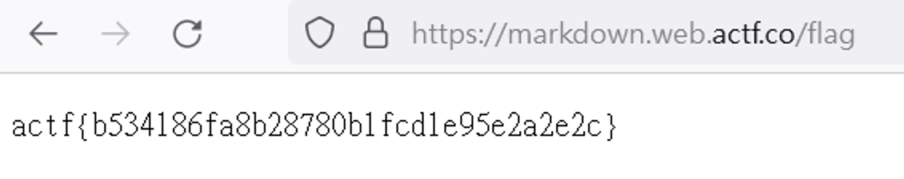

# ångstromCTF 2024 - markdown   
 --- 
題目設計的主題是一個簡單的markdown筆記應用，創造筆記之後可以將url分享給朋友，讓對方瀏覽你製作的筆記   
    
    
筆記應用頁面本身沒有什麼敏感資料，但嘗試幾次發現：
1. 會繞過`<script>` payload
2. 在內文輸入其它html tag都可以成功注入

找到可以使用的XSS payload:
``    
成功注入XSS後的效果如下   
    

``    
此攻擊方法：
在本機上運行一個可以竊取cookies的惡意程式碼，透過ngrok轉發之後注入在markdown筆記內，形成一個stored XSS。   
    
將具有XSS的筆記分享給目標受害者，就可以成功取得他的token並且取得flag   
    
    
> code   

```
const crypto = require('crypto')


const express = require('express')

const app = express()


const posts = new Map()


app.use(express.urlencoded({ extended: false }))


app.get('/', (_req, res) => {

    const placeholder = [

        '# Note title',

        'Content of the note. You can use *italics*!',

    ].join('\n')


    res.type('text/html').end(`

        <link rel="stylesheet" href="/style.css">

        <div class="content">

            <h1>Pastebin</h1>

            <form action="/create" method="POST">

                <textarea name="content">${placeholder}</textarea>

                <button type="submit">Create</button>

            </form>

        </div>

    `)

})


app.get('/flag', (req, res) => {

    const cookie = req.headers.cookie ?? ''

    res.type('text/plain').end(

        cookie.includes(process.env.TOKEN)

        ? process.env.FLAG

        : 'no flag for you'

    )

})


app.get('/view/:id', (_req, res) => {

    const marked = (

        'https://cdnjs.cloudflare.com/ajax/libs/marked/4.2.2/marked.min.js'

    )


    res.type('text/html').end(`

        <link rel="stylesheet" href="/style.css">

        <div class="content">

        </div>

        <script src="${marked}"></script>

        <script>

            const content = document.querySelector('.content')

            const id = document.location.pathname.split('/').pop()


            delete (async () => {

                const response = await fetch(\`/content/\${id}\`)

                const text = await response.text()

                content.innerHTML = marked.parse(text)

            })()

        </script>

    `)

})


app.post('/create', (req, res) => {

    const data = req.body.content ?? ''

    const id = crypto.randomBytes(8).toString('hex')

    posts.set(id, data)

    res.redirect(`/view/${id}`)

})


app.get('/content/:id', (req, res) => {

    const id = req.params.id

    const data = posts.get(id) ?? ''

    res.type('text/plain').end(data)

})


app.get('/style.css', (_req, res) => {

    res.type('text/css').end(`

        * {

          font-family: system-ui, -apple-system, BlinkMacSystemFont,

            'Segoe UI', Roboto, 'Helvetica Neue', sans-serif;

          box-sizing: border-box;

        }


        html,

        body {

          margin: 0;

        }


        .content {

          padding: 2rem;

          width: 90%;

          max-width: 900px;

          margin: auto;

        }


        input:not([type='submit']) {

          width: 100%;

          padding: 8px;

          margin: 8px 0;

        }


        textarea {

          width: 100%;

          padding: 8px;

          margin: 8px 0;

          resize: vertical;

          font-family: monospace;

        }


        input[type='submit'] {

          margin-bottom: 16px;

        }


    `)

})


app.listen(3000)
```
